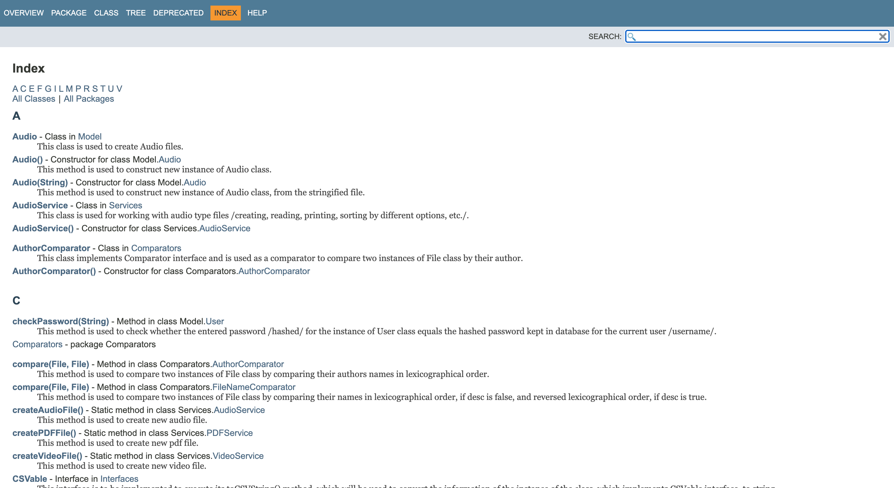

## Project to apply various concepts of JAVA language
This project allows users to register, and registered users can create PDF,
Audio and Video files and sort them in the suggested ways.

Used concepts: 
  - Streams API 
  - Threads
  - Runnable
  - Lambda functions
  - Java Documentation Comments
  - Custom Comparators
  - Custom Exceptions
  - OOP
  - Inheritance
  - Polymorphism
  - Overloading
  - Overriding
  - Enhanced switch statements
  - Scanners
  - Boxed types
  - Constructors
  - Interfaces
  - Final variables
  - Static variables
  - Static Methods
  - Abstract methods
  - Abstract class
  - Lists
  - Array Lists
  - HashMaps
  - Regular Expressions
  - Generic Wildcards
  - etc ...


_**Dialogue example 1:**_
```
----------Menu-----------
1. Sign up.
2. Already signed in? Log in.
3. Exit Login Menu.
```

_**Dialogue example 2:**_
```
----------Menu-----------
1. Choose PDF SubMenu
2. Choose Audio SubMenu
3. Choose Video SubMenu
4. Print total count of created Files.
5. Exit the Menu!
```

_**Dialogue example 3:**_
```
------------Video SubMenu--------------
1. Create Video File
2. Print all Video files
3. Print all Video files sorted by duration.
4. Print Video files with duration more than 10 seconds /10,000 mls/.
5. Print Video files with duration less/equal than/to 10 seconds /10,000 mls/.
6. Print all Video files sorted by their contents length.
7. Play selected Video file from the Video files.
8. Exit the Video SubMenu

```
_**JAVA Doc example:**_

